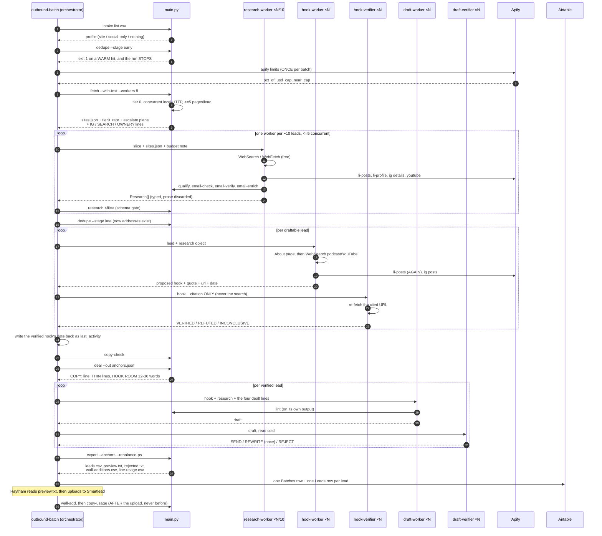

# Proposal: retrieve once, then select

_Written 2026-08-01. A proposal, not a decision._

_**P0, P1 and P2 of Part 9 landed on 2026-08-01**: the retrieval ledger, the
`Observation` contract with its schema gate, and `resolve` — a typed Identity
per lead, link-in-bio pages finally read, and podcast hosts recognised. All
three are additive and none changes how a hook is found; the duplicate
`li_posts` fetch in F1 is still made on purpose, so it can be removed against a
measurement instead of an argument. P3 and P4 remain proposal._

_**One departure from Part 5, recorded rather than quietly made.** `resolve`
runs after `fetch`, not before it. Part 5's ordering has no `fetch` stage at all
— tier 0 is absorbed into `observe` by then — so resolving first in the machine
as it stands would mean reading each homepage and reading it again seconds
later: 89 duplicate `(lead, url)` pairs on the first batch, which would bury the
one duplicate the ledger exists to expose. See D22 in `docs/spec/07-decisions.md`.
P2 also fixed two bugs found underneath it: `_SOCIAL_RE` was harvesting the Meta
pixel as a lead's Facebook page, and `dedupe` was indexing podcast hosts on the
wall._

_Everything below is left as written, so the reasoning the phases rest on is
still readable in its original form._

**The thesis in one line: the hook stage should not retrieve anything.**
Evidence is fetched once per lead, into a typed record, and every stage after
that reads the record. The only component allowed to fetch a second time is the
one whose entire job is to distrust what was fetched the first time.

## Why this document exists in this shape

The brief asked for a critique and an architecture. It also asked, correctly,
that the current machine be reconstructed accurately first — so Part 1 is the
system as it actually runs today, and no proposal appears until Part 4.

Two things this document deliberately does not do. It does not optimise a
prompt. And it does not claim a saving it cannot measure: the section on
expected improvements names what is bounded, and says plainly where the honest
answer is "this becomes measurable" rather than "this gets better".

### A note on the doc gate

`python main.py doc-check` runs over `docs/` in CI. It fails on any `main.py`
command in backticks or a fenced block that is not in the parser, and on any
backticked path that is not on disk. That gate assumes a doc describes what
exists, and a proposal is a category it did not have. So when this document was
written, **every command proposed here was put in plain prose without
backticks**, and proposed module paths appeared only inside fenced blocks, which
the path check exempts. That was a workaround, and the note here said the right
fix was for doc-check to learn about `docs/proposals/` rather than for the
convention to spread.

**It has.** `docs/proposals/` is now in doc-check's `EXCLUDED` map alongside the
journal, with its reason stated and reported on `skipped`. The prose below is
left as it was written — the workaround is no longer needed, but rewriting the
argument to show that off would be a strange use of a document nobody has
finished acting on yet.

---

# Part 1 — The machine as it runs today

## 1.1 The run

`.claude/skills/outbound-batch/SKILL.md` is the orchestrator. It is a skill in
the main loop, not a program, so the ordering below is prose that a model
follows rather than a pipeline a scheduler executes. That matters for Part 2.



## 1.2 Every decision point

| # | Where | Decision | Failure mode |
|---|---|---|---|
| 1 | `dedupe --stage early` | warm thread hit | **exit 1, run stops.** The one failure that destroys rather than wastes |
| 2 | `dedupe` | wall unreadable *or empty* | exit 2 — never "nobody has been contacted" |
| 3 | `apify limits` | `near_cap` at 90% | advisory, passed into every worker prompt as prose |
| 4 | `fetch` | page 200s with no text | escalate to render; anything else escalates to static |
| 5 | `fetch` | `--escalate` absent | plan printed, nothing spent (**default**) |
| 6 | `check_owner` | site never names the lead | **advisory only.** Never a kill |
| 7 | `qualify` | a clear `no` on any floor | drops the row. `unclear` passes |
| 8 | `research` | verdict outside enum, or yes/no with no source | schema violation, back to the worker once |
| 9 | hook-worker | which rung to try | **prose, per agent, unlogged** |
| 10 | hook-verifier | quote absent / not theirs / stale / generic | REFUTED. Default is refuted |
| 11 | orchestrator | ≥2 refutes in the first wave | stop and surface before spending the queue |
| 12 | `deal` | live copy fails the linter | exit 1, no override |
| 13 | `deal` | table unreadable | exit 1 unless `--allow-cached-copy` |
| 14 | draft-verifier | REWRITE | back to the drafter **once**, then it holds |
| 15 | `export --anchors` | draft's line id or text disagrees with the deal | row dropped from the file |
| 16 | `export` | any batch-level check fails | **the whole file is blocked** |

## 1.3 Every external dependency

| Dependency | Used for | Failure posture |
|---|---|---|
| Apify | 9 actors; the only paid layer | cost gate at $0.10, exit 3 above it |
| Apify (harvestapi) | `li_profile` | a ~20 runs/month **vendor-side** quota that `account_limits()` cannot see and the cost gate cannot price. Fails as a mid-batch actor error on run 21 |
| Airtable | Copy Assets (authority on copy), Leads, Batches | `deal` blocks on unreadable; `copy/*.csv` is a cache, never a second opinion |
| Free HTTP | tier 0, `requests` + BeautifulSoup | never raises; a failure is a `Page` with an error on it |
| Agent WebSearch / WebFetch | tier 1 | model-side, unmetered, **unlogged** |
| Smartlead | sending, warmup, sequence, replies | **no API key. CSV handover by hand.** Nothing flows back |

## 1.4 Every LLM call

Per lead, in a batch of N:

| Agent | Model | Passes | Retrieves? |
|---|---|---|---|
| `research-worker` | sonnet | 1, amortised over a ~10-lead slice | **yes** — WebSearch, WebFetch, Apify |
| `hook-worker` | sonnet | 1 | **yes** — WebSearch, WebFetch, Apify |
| `hook-verifier` | sonnet | 1 | yes — WebFetch, exactly one URL |
| `draft-worker` | inherited | 1, +1 on REWRITE | no |
| `draft-verifier` | inherited | 1 | no |

**Three retrieving agents per lead. Two of them are searching for evidence, and
they do not share any.**

## 1.5 Every Apify actor

`ACTORS` in `audit/apify.py`. Nine, and the map is deliberately tight.

| Key | Actor | Purpose | Batchable | Called by |
|---|---|---|---|---|
| `li_posts` | harvestapi/linkedin-profile-posts | recent posts + dates — the richest hook source | **No, proven.** `maxPosts` is a run-wide budget: 2 URLs, cap 10, all 10 came from one profile | research-worker **and** hook-worker |
| `li_profile` | harvestapi/linkedin-profile-scraper | headline / about / experience; optional email search at 2.5× | Yes, correlates per URL | research-worker |
| `ig_profile` | apify/instagram-profile-scraper | bio, followers — the tier-0 read for IG-only leads | Yes, `usernames` is an array | research-worker |
| `ig_post` | apify/instagram-post-scraper | recent captions, date-filterable | **No, untested** — assumed to share `li_posts`' flaw | hook-worker |
| `yt_channel` | apidojo/youtube-channel-information-scraper | subscriber count | n/a (1 item) | research-worker |
| `email` | michael.g/email-verifier-validator | deliverability | Yes | research-worker |
| `search` | apify/google-search-scraper | Google SERP | Yes (pages) | `footprint_search` only |
| `site_static` | apify/cheerio-scraper | tier 2a, static | Yes, one run per batch | `fetch --escalate` |
| `site_render` | apify/website-content-crawler | tier 2b, browser | Yes, one run per batch | `fetch --escalate` |

## 1.6 The measured baseline

From `docs/journal.md`, the only real batch (2026-08-01):

```
155 raw -> 151 clear (2 walled, 2 in-batch dupes, 0 WARM)
151     -> 106 passed the three floors
slice 1 of 16 carried to the end:
        8 draftable -> 3 hooks VERIFIED -> 1 SEND
tier 0:  89/151 sites read free (59%)
Apify:   ~$1.36 for the whole batch (~$0.009/lead)
```

**Read the cost line carefully, because it reframes the brief.** The hook stage
is expensive, but it is not expensive in dollars. At $0.009/lead the entire paid
layer is a rounding error against the value of one booked meeting. What the hook
stage actually spends is **agent passes and wall-clock**: two of the three
retrieving agents per lead, each opening a context, each searching the open web
serially, each waiting on network. The architecture below attacks both, and is
honest about which saving is large.

---

# Part 2 — What is wrong, and why

## F1 — The same evidence is retrieved twice, and nothing dedupes it

`research-worker` is told to run `apify li-posts <url> --max 5`.
`hook-worker` is told to run `apify li-posts <url> --max 5 --since 3months`.

Same actor, same profile, same lead, two container boots. The flags differ, so
even a command-keyed cache would miss. And `li_posts` is the one actor that
*cannot* be batched — proven by direct test — so this is the single most
expensive call in the machine, made up to twice per lead.

**Why it exists:** the two agents were specified independently, each given a
correct cost ladder, and neither was given the other's output. Nothing in the
system represents "what has already been fetched for this lead", so there is
nothing a second agent could consult even if it wanted to.

## F2 — Research discards the evidence the hook stage then pays to refetch

`outbound/research.py` stores a `_source` **string** per verdict. That is a URL
or a page name. The LinkedIn post text that settled `active_recent` — the exact
material a hook is made of — is not stored anywhere. There is no observation
type in this repository.

So the machine pays for a LinkedIn post, extracts one boolean and a URL from it,
throws the post away, and pays again.

**Why it exists:** the research contract was designed to answer *floors*, and it
answers them well. The hook was designed as a separate concern with its own
agent. The contract is the right shape for the question it was asked; it was
never asked to carry evidence forward.

## F3 — The activity floor runs one stage before its evidence exists

`latest_activity_date` found **zero usable dates across nine sites and ~220,000
characters**. So `active_recent` comes back `unclear` for effectively every
lead, and `unclear` passes — the floor does nothing.

The signal exists: LinkedIn posts are dated. The hook stage fetches them. So the
batch skill instructs the orchestrator to write the verified hook's date back as
`last_activity` *after* stage 3.

That is a workaround for an ordering defect. A floor is being evaluated at stage
2 against evidence that arrives at stage 3, and the repair is a manual
write-back an orchestrator has to remember.

## F4 — The hook is the only consequential artifact with no mechanical gate

Everything else in this machine is gated by code that fails closed:

| Artifact | Gate |
|---|---|
| research object | `python main.py research` |
| copy line | `python main.py copy-sync`, `python main.py copy-check` |
| anchor allocation | `python main.py export --anchors` |
| draft | `python main.py lint` |
| address | `python main.py email-check`, `python main.py email-verify` |
| docs | `python main.py doc-check` |
| **hook** | **an agent, and prose** |

The `Research` dataclass already carries `hook`, `hook_type`, `hook_source_url`,
`hook_quote`, `hook_date`, `hook_verified` — and `validate()` already enforces
two rules on them ("a hook with no source URL", "cites a URL but quotes nothing
from it"). But the hook stage does not go through that schema, because the hook
stage returns prose to an orchestrator.

This is a direct violation of the machine's own stated principle: *prefer a
mechanical check to an agent, always*.

## F5 — The stated cost order is undermined by the acceptance criteria

Both `docs/hook-rules.md` and `.claude/agents/hook-worker.md` were reordered on
2026-07-31 to put the free About page at rung 1. **So the brief's hypothesis —
that the system searches LinkedIn first — is already false, and both files carry
a comment explaining the fix.** Credit where it is due.

But the ordering is undermined one file over. `hook-verifier` REFUTES anything
that "could be sent unedited to another coach in the same segment", and ban #1
prohibits generic site copy. Generic About prose is exactly that. So:

> **The cheapest rung produces the observations most likely to be refuted.**

An agent that walks the ladder honestly spends rung 1, gets refuted, and walks
to the paid rungs anyway — having paid for the round trip. The ordering is
correct and the yield per rung is not measured, so nobody can see this happening.

The fix is not to reorder. It is to narrow rung 1 to what survives the
specificity test: a **named framework** or a **founding story they wrote**, not
About prose in general. Those are `kind=framework` observations. Everything else
on an About page should not be offered to the hook at all.

## F6 — Retrieval strategy is prose, duplicated, and not per-lead

Where to search lives in two markdown files that must be kept in agreement by
hand. There is no code path, no config, no data structure. Consequences:

- **Not per-lead.** Nothing tells a hook-worker which rungs are even populated
  for its lead. `fetch` prints an `IG` line for Instagram-only leads — the one
  piece of routing that exists — and nothing else.
- **Not budgeted.** Each agent independently decides to reach for LinkedIn. The
  batch budget is checked once and passed down *as a sentence*.
- **Not logged.** Which rung produced a hook, and which rungs were walked for
  nothing, is not recorded anywhere.

Three leads on the first batch walked the full ladder — LinkedIn, Instagram, the
open web — and returned nothing. That is the correct answer, and it cost three
full agent passes to reach. Nothing knows it happened.

## F7 — Identity resolution is real work, done three times, all advisory

**~40 of 151 rows on the first batch pointed at the wrong person**: parked
domains, name collisions, a coach's training school, an Ohio retreat house, a
Dutch tech-news site. There are three partial checks, and every one is advisory:

| Check | Where | Result |
|---|---|---|
| handle contains the name? | `normalize._profile_name_notes` | a note |
| site mentions the name? | `fetch.check_owner` | `OWNER-CHECK` report line, "advisory, never a kill" |
| is this really them? | each agent, improvised | re-sourced by hand, after the money |

Being advisory is the right call for a *kill* — a false kill is permanent and
invisible. But it is the wrong call for a *spend*. Nothing gates paid retrieval
on ownership, so the machine will happily pay to scrape the LinkedIn of a
different person with the same name.

## F8 — Link-in-bio pages are classified as research targets and never fetched

`normalize.PLATFORM_HOSTS` routes `linktr.ee`, `beacons.ai`, `stan.store`,
`bio.link`, `milkshake.app` and `taplink.cc` into `other_urls`, with a comment
explaining that dropping them was a real bug worth fixing.

`fetch.batch_fetch` targets `lead.site_url` and nothing else. `other_urls` is
never fetched by any stage.

A linktree is a free HTTP page that lists every channel a coach has. It is the
single cheapest identity-resolution artifact available, it is already
discovered, and it is discarded.

## F9 — There is no podcast discovery anywhere

`fetch._SOCIAL_RE` matches linkedin, instagram, youtube, facebook, tiktok. Rung
2 of the hook ladder is "podcasts and YouTube". No Spotify, Apple Podcasts,
anchor.fm, Buzzsprout or RSS host is recognised in this repository.

So the rung that "reaches the coaches who do not post" — the rung that exists
precisely for the leads where LinkedIn is dry — is served entirely by agent
WebSearch improvising a query. That is the most expensive way to find a URL.

## F10 — Two actors serve dead or duplicated requirements

- **`yt_channel`** returns a subscriber count, and nothing else. Its only
  consumer is `audience_size` — a field the ICP explicitly *captures and never
  gates on*, because "audience decoupled from the offer the moment we started
  selling their clients rather than leverage on their list". A paid actor is
  wired to a field that, by design, changes no decision.
- **`search`** duplicates the agent's free WebSearch. `audit/footprint.py` says
  so itself: the free path is "the preferred path — it costs nothing beyond what
  is already running", and `footprint_search` "remains a manual fallback".

Neither is a large bill. Both are surface area, and `audit/apify.py`'s own
docstring sets the standard: *"Adding actors is surface area and cost, not
capability."*

## F11 — `hook_room` is computed after the hook is written

`deal` runs at stage 4. The hook is written at stage 3. The live bank leaves
between 12 and 36 words for a hook depending on the draw.

So a hook can be found, verified against a verbatim quote, and then handed to a
drafter with 12 words of room. `draft-worker` is explicitly told the four lines
are "never available to you" and to cut its own words first — which means
compressing a sentence whose exact wording an independent verifier just
certified.

## F12 — There is no telemetry of any kind

No per-lead cost. No hook source platform. No runtime persisted — `batch_fetch`
computes `elapsed_secs`, prints it, and drops it. No record of which rung was
tried, which produced a hook, or which was walked for nothing.

The Batches table has `Tier 0 Rate` and `Apify Cost USD` fields. Nothing writes
them; the skill asks a model to fill them in by hand at the end of a run.

**Every claim in Part 2 about cost had to be reconstructed from a journal entry
somebody wrote by hand.** That is the finding underneath all the others: this
machine cannot currently tell you what its most expensive stage costs.

---

# Part 3 — What is already right

A critique that only finds faults is not a critique. These are load-bearing and
the proposal does not touch them.

- **The worker/verifier split earns its cost.** On the first batch it caught a
  hook-worker overstating a lead's role ("ran the workshop" when his own post
  said invited participant) and another claiming "this month" for a 30-day-old
  comment. Both refutations were correct.
- **Three verdicts, not two.** INCONCLUSIVE holding rather than killing is the
  same asymmetry as `unclear` passing, applied one stage later.
- **`unclear` passes.** A false kill is permanent and invisible; a false pass
  costs one research call. This is the single best decision in the codebase.
- **Dedupe before spend, with the warm hit stopping the run.**
- **Tier 2 is already escalate-only.** The brief asks whether the crawler should
  become a fallback instead of the default. It already is: without `--escalate`
  the plan is printed and nothing is spent. No change needed.
- **`li_posts` staying un-batched.** Batching it would have saved container
  boots and silently starved most leads of post data. Somebody tested it rather
  than assuming, and wrote down the result.
- **The batched tier-2 plan.** One container boot per batch instead of per lead
  is exactly the right lever, correctly identified.
- **The cost gate's honesty about compute-billed actors.** Distinguishing "the
  price lookup failed" from "this genuinely cannot be priced per item" is the
  kind of distinction most systems collapse.

---

# Part 4 — The invariant

Everything below follows from one rule:

> **Information is retrieved exactly once per lead, per source. Every stage
> after retrieval consumes structured observations. The only permitted second
> fetch is a verification, and it must be a live fetch, not a cache read.**

Three clarifications, because the rule is only useful if its edges are sharp:

1. **The unit is (lead, source), not lead.** Fetching a LinkedIn profile and
   then a podcast episode is not a second retrieval. Fetching the same LinkedIn
   profile twice is.
2. **A targeted escalation is a first fetch.** If selection rejects every
   candidate and asks for one more rung, that rung has not been retrieved yet.
   That is permitted, bounded, and logged.
3. **The verifier is exempt, and must stay exempt.** A verifier that reads the
   cached observation is certifying the cache — it would be confirming that we
   copied a string correctly, not that the words are on the page. This is the
   one place in the system where a duplicate fetch is the entire point.

**The invariant is enforceable, and should be enforced mechanically**, in
keeping with the machine's own principle. The retrieval ledger (Part 8) is not
only telemetry: a second fetch of the same `(lead_key, url)` that is not tagged
`verify` is a failure the run can be made to report.

---

# Part 5 — The proposed architecture

```
intake         unchanged
dedupe early   unchanged
resolve   ★    free-only identity resolution -> Identity per lead
plan      ★    mechanical retrieval plan, batch-budgeted, per-lead rungs
observe   ★    ONE retrieval pass -> Observation[]
               (absorbs the retrieval halves of research-worker AND hook-worker)
qualify        consumes Observations; active_recent finally has evidence
dedupe late    unchanged
deal           MOVED EARLIER — hook_room known before the hook is written
select    ★    ranking over Observations + one authored clause. No fetching.
verify         hook-verifier, UNCHANGED, still re-fetching LIVE
draft          unchanged
lint / export  unchanged
```

## 5.1 Stage responsibilities

**`resolve` (new).** Free only, no paid call, no LLM. Takes Leads, emits one
`Identity` per lead. It fetches link-in-bio pages (F8), harvests socials from
the homepage using the existing `fetch._SOCIAL_RE` extended with podcast hosts
(F9), and scores each candidate channel for ownership by promoting the two
existing advisory checks — `normalize._profile_name_notes` and
`fetch.check_owner`, both already built on the shared `email_check.name_tokens`
— into one typed confidence per channel (F7).

*It still never kills a lead.* What it does is gate **spend**: `plan` will not
buy a LinkedIn scrape for a channel whose ownership confidence is low, and will
say so. A false kill stays impossible; a false *purchase* becomes visible.

**`plan` (new).** Mechanical, cheap, unit-testable, no LLM. Takes Identity plus
the batch Apify budget and emits a `RetrievalPlan`: which channels to hit, which
go into a batched actor run (`ig_profile` details, `li_profile`, the two site
actors), which need a per-lead run (`li_posts`, `ig_post`), and what the
per-lead rung ceiling is. **This is where "which platform, in what order" stops
being prose in two markdown files and becomes a data structure with a cost model
attached** (F6). It is also where the batch budget stops being a sentence passed
into a prompt and becomes an allocation.

**`observe` (new, absorbs work).** One retrieval pass per lead. Executes the
plan, returns `Observation[]`. This is the *only* stage permitted to fetch
outside verification. It is still a fan-out over slices of ~10 leads, the same
shape as `research-worker` today — this is a re-scoping, not a new agent
population.

**`qualify` / research schema.** Now reads Observations. `active_recent` is
settled from `published_at` on real dated observations, at the stage where the
floor actually runs (F3). The `last_activity` write-back disappears.

**`select` (new, replaces hook-worker's search).** No tools that fetch. It
ranks the lead's observations against the four requirements and the twelve bans,
picks one, and writes the clause that says what the writer took from it — the
"writer in it" requirement, which is the only genuinely authorial part of the
hook and the one that cannot be mechanised. It knows `hook_room`, because `deal`
now runs first (F11). If it rejects every observation, it may request **one**
bounded escalation through `plan`.

**`verify` (unchanged).** Same agent, same prompt, same independence, still one
live fetch of one URL. Do not touch this.

## 5.2 Answering the brief's questions directly

**Single responsibility — which components do several jobs?**
`hook-worker` does four: discovery (which platform), retrieval (fetching it),
interpretation (is this a hook), and authorship (the clause with a writer in
it). `research-worker` does three: retrieval, interpretation, and address
verification. `fetch` does three: retrieval, social-URL discovery, and ownership
checking. The proposal splits discovery (`resolve`), routing (`plan`), retrieval
(`observe`), interpretation and authorship (`select`) — leaving each with one.

**Is the search order static? Configurable? Always LinkedIn first?**
Static, not configurable, and **no** — About page is rung 1 and has been since
2026-07-31. The real defect is that it is not *per-lead* and not *measured*
(F6), and that rung 1's yield is silently poisoned by the verifier's specificity
test (F5).

**Where is money being wasted?** Duplicate `li_posts` boots (F1), paid scrapes
of channels that belong to somebody else (F7), `yt_channel` feeding a
never-gated field and `search` duplicating free WebSearch (F10). In absolute
terms this is small. **The larger waste is agent passes**, and it is invisible.

**Should identity resolution become its own stage?** Yes — and this is the
highest-value change in the document, worth doing *even if the hook stage were
left alone*, because it addresses a defect that cost ~40 of 151 rows.

**Should metadata extraction precede content crawling?** Yes, but say what it
buys honestly. Tier 0 currently reads up to 5 pages for all 151 clear leads;
only 106 pass the floors. Fetching the homepage, running the floors, and reading
the remaining pages only for survivors would cut roughly 30% of tier-0 page
fetches. That is **free HTTP**, so this is a wall-clock saving, not a money one.
Worth doing, not worth leading with.

**Can research emit structured observations, and can hook finding consume them
instead of scraping again?** Yes. That is the proposal.

---

# Part 6 — Data contracts

```
Observation                          outbound/observe.py (proposed)
  lead_key      str
  platform      linkedin|instagram|youtube|podcast|facebook|tiktok|site|web
  url           str                  the page actually fetched
  fetched_at    ISO datetime         when WE fetched it
  published_at  ISO date | null      when THEY published it
  author        self | third_party | unknown
  kind          post|episode|video|about|framework|result|bio
  text          str                  verbatim, never summarised
  cost_usd      float
  retrieved_by  tier0 | websearch | apify:<actor_key>
```

One record, four consumers that today each fetch their own:

| Consumer | Field it needs |
|---|---|
| `active_recent` floor | `published_at` |
| `coach_type` capture | `text` where platform is linkedin |
| hook selection | all of it |
| the ledger | `cost_usd`, `retrieved_by`, `platform`, `fetched_at` |

Three of the twelve bans become **mechanical** rather than instructions an agent
is asked to remember:

- ban #7, no third-party coverage → `author == "self"`
- ban #6, no stale news as fresh → `published_at` inside 90 days
- ban #1, no generic site copy → `kind != "about"` (only `framework` survives
  from a site, per F5)

```
Identity                             outbound/resolve.py (proposed)
  lead_key      str
  channels      [Channel{platform, url, confidence, evidence}]
  owner_verdict confirmed | absent | unknown

HookProposal                         schema-gated by a proposed command
  observation_id, line, hook_type, quote, source_url, date, confidence
```

`HookProposal` closes F4: it gives the hook the same schema treatment research
already has, and it makes `observation_id` the join that proves the hook came
from something actually retrieved rather than something composed.

---

# Part 7 — What I am rejecting from the brief

The brief asked for these abstractions and asked to be argued with. Four survive.

| Proposed | Verdict | Reason |
|---|---|---|
| **Scout** | **Accept**, as `resolve` | Highest-value change here, and it pays off independently of the hook stage |
| **Retriever** | **Reject as a stage** | Split it. The useful cut is *deciding what to retrieve* (`plan`, mechanical and testable) from *retrieving it* (`observe`). A generic "Retriever" wrapping both hides exactly the decision that is currently unexamined |
| **Observation Extractors** | **Reject as agents** | An LLM pass per platform per lead is precisely the cost being cut. This would make the pipeline *more* expensive while looking more principled. Extraction is a typed return from `observe` plus mechanical parsers that already exist — `extract_dates`, `visible_text`, `extract_emails` |
| **Selector** | **Accept** | This is the change that turns hook-finding from search into ranking, and it is where the cost actually falls |
| **Verifier** | **Accept, unchanged** | Already minimal at one fetch. Its independence is the mechanism; do not optimise it |
| **Writer** | **Accept, unchanged** | Not implicated in retrieval cost at all |

Two further rejections worth stating:

**Do not cache for the verifier.** The obvious "optimisation" once observations
exist is to let the verifier read the stored text and skip the fetch. That
would save one fetch per lead and destroy the only mechanism in this system that
has actually caught a fabricated claim. The verifier's fetch is not overhead; it
is the product.

**Do not make `select` a large model call with the full observation set.** The
temptation is to hand every observation to a strong model and ask for the best
hook. That reintroduces the cost in a different currency. Rank mechanically
first — recency, `author == self`, `kind`, length against `hook_room` — and hand
the model a shortlist of three.

---

# Part 8 — Metrics

Nothing is measured today (F12). The proposal is a run ledger plus CRM fields.

**A ledger**, one JSON line per retrieval and per stage transition, written as
the run proceeds so a crashed batch still leaves its accounting:

```
data/runs/<batch>.jsonl        (proposed)
  {"lead_key", "stage", "platform", "url", "retrieved_by",
   "cost_usd", "secs", "outcome", "purpose": "observe" | "verify"}
```

`purpose` is what makes the Part 4 invariant enforceable rather than aspirational.

**Per lead:** `cost_usd`, `observations_count`, `hook_source_platform`,
`hook_rung`, `retrieval_secs`, `agent_passes`.

**Per batch**, extending the existing `Tier 0 Rate` and `Apify Cost USD`:

| Metric | Why it matters |
|---|---|
| `hook_yield` (verified / attempted) | baseline: 3 of 12 draftable |
| `yield_by_rung` | **the number that fixes F5.** If rung 1 yields near zero after verification, narrowing it is proven rather than argued |
| `refute_rate` | the tripwire already in the skill, made a measurement |
| `null_hook_rate` | 3 of 12 on the first batch. Null is a good answer; an increase is not |
| `wasted_retrieval` | paid fetches on leads that produced no hook — **the number this whole proposal is trying to move** |
| `cost_per_verified_hook` | the only cost figure that is per-unit-of-value |
| `agent_passes_per_lead` | the real bottleneck, currently unrecorded |

**Downstream — and here the honest answer is that we cannot.** Positive reply
rate, meeting rate and cost per booked meeting all require reply data.
**Smartlead owns replies and there is no API key in this repo.** Listing those
metrics without a collection path would be exactly the kind of aspirational
measurement this machine otherwise refuses.

The bridge that works today is manual: Haytham exports a replies CSV from
Smartlead, and a proposed command joins it on `email` to the batch's Leads rows.
That makes `hook_type` and `hook_source_platform` testable against reply rate —
which is the reason `Hook Type` is a select in the CRM in the first place, per
its own field description: *"a testable variable against reply rate rather than
a detail buried in prose."* The variable exists. The test has never been run.

**State it plainly: this repo cannot currently compute any part of cost per
booked meeting past export.** For an offer that is sold on a call, that is the
metric that matters most, and it is the one gap that no amount of retrieval
architecture closes.

---

# Part 9 — Migration

Five phases, each independently shippable, instrumentation first.

**P0 — the ledger. No behaviour change.** Write `cost_usd` and `secs` at every
retrieval site that already exists. This goes first because every claim in Parts
2 and 11 is currently reconstructed from a hand-written journal entry, and
because P3 cannot be evaluated without a baseline to compare against.

**P1 — the `Observation` contract, additive.** Add the dataclass and its
validate command. Have `research-worker` return observations *alongside* its
existing verdicts. `hook-worker` untouched. At the end of P1 the machine is
doing slightly more work and nothing has been removed — but the duplicate fetch
in F1 becomes *visible in the ledger*, which is the proof the saving is real.

**P2 — `resolve`.** Promote the two advisory ownership checks into a typed
Identity, fetch link-in-bio pages, add podcast hosts to `_SOCIAL_RE`. Still no
change to how the hook is found. Ships value on its own via F7/F8/F9.

**P3 — `plan` and `select`.** The one real behaviour change: hook-worker stops
fetching. Gate it behind a batch where P0's numbers can compare before and
after, on the metrics in Part 8 and — critically — on `null_hook_rate` and
`hook_yield`, not on cost alone.

**P4 — pruning.** Retire `yt_channel` and `search`; homepage-first tier 0.
Deliberately last: it is the least valuable and the most likely to be argued
about, and putting it first would stall the phases that matter.

**Doc discipline:** each phase changes `docs/spec/05-pipeline.md` in the same
commit, per the repo's standing rule, and `python main.py doc-check` enforces it.

---

# Part 10 — Risks

**R1 — Collapsing hook retrieval into `observe` may lose the hook-worker's
judgement.** Somebody searching for a hook searches differently from somebody
searching for a floor verdict — they follow a thread, they read the comments,
they notice the framework nobody named. A retrieval pass optimised for floors
could return observations that are individually valid and collectively bland.
*This is the most serious risk in the proposal.* Mitigations: `observe` is given
the hook criteria explicitly, not just the floor questions; `select` may reject
everything and request one bounded escalation; and P3 is gated on
`null_hook_rate` and `hook_yield`, so a quality regression shows up as a number
rather than as a vague sense that the emails got worse.

**R2 — A verifier that reads the cache is not a verifier.** Stated in Part 4 and
Part 7 and repeated here because it is the failure that would quietly undo the
whole worker/verifier chassis while appearing to be an optimisation.

**R3 — `plan` declining a rung is a new false-negative surface.** It is the same
class of error as a false kill: permanent, invisible, and on the wrong side of
the machine's own asymmetry. Mitigation: `plan` records what it declined and
why, the declines surface in the batch brief, and the ownership confidence that
gates spend must never gate *inclusion*.

**R4 — Moving `deal` earlier fixes F11 and shifts allocation.** Deal-before-hook
means the allocation is made before some leads hold on a refuted hook. That is
exactly the situation `--rebalance-ps` already exists for, and the skill already
instructs passing it whenever any lead held. Existing mitigation, no new
machinery — but it will fire more often, and the ps weight drift it reports
should be watched.

**R5 — Observations go stale.** A cached observation fetched at the start of a
long batch is hours old by drafting time. This is mostly harmless — the hook
cites a dated post, not a live page — but `fetched_at` exists on the record so
staleness is answerable rather than assumed, and the verifier's live fetch is
the backstop that makes it safe.

**R6 — This is a large refactor of a machine that has completed exactly one real
batch.** One batch of evidence is thin ground for an architecture. The phasing
in Part 9 is designed around this: P0 and P1 are additive and reversible, and
nothing irreversible happens until P3, by which point there are numbers.

---

# Part 11 — Expected improvements

Bounded, and honest about which are estimates.

**Solid:**

- **Retrieving agents per lead: 3 → 2** across research and hook. The verifier
  stays. Roughly a third of the retrieving agent passes, and — because those
  passes are serial network waits — a comparable share of hook-stage wall-clock.
- **Duplicate `li_posts` boots: eliminated.** Up to one per lead, on the one
  actor that provably cannot be batched.
- **Retrieval becomes attributable and cappable.** Today no per-lead cost exists
  at all and the budget is a sentence in a prompt. This is a smaller headline
  than a percentage but it is the precondition for every other improvement.

**Estimated:**

- **Tier-0 page fetches: roughly −30%** from homepage-first, on the first
  batch's 106-of-151 floor pass rate. Free HTTP — wall-clock only.
- **Two actors retired**, removing surface area rather than meaningful cost.

**Explicitly not promised:**

- **Hook yield.** The baseline is 3 verified of 12 draftable. Nothing here
  promises to raise it. The claim is that yield becomes measurable *per rung*,
  which is the precondition for raising it — and that F5 predicts rung 1 is
  currently yielding near zero after verification, which `yield_by_rung` would
  confirm or refute in one batch.
- **A large dollar saving.** At $0.009/lead there is not one available. Anyone
  presenting this as a cost-reduction project in dollars is reading the wrong
  number.

**The honest summary: this proposal buys wall-clock, agent passes, and — more
than either — the ability to see what the hook stage is doing. The first real
batch could not answer "which rung produced our hooks" or "what did the leads
that produced nothing cost us." Those questions should be answerable before
anybody tries to make the stage better.**
